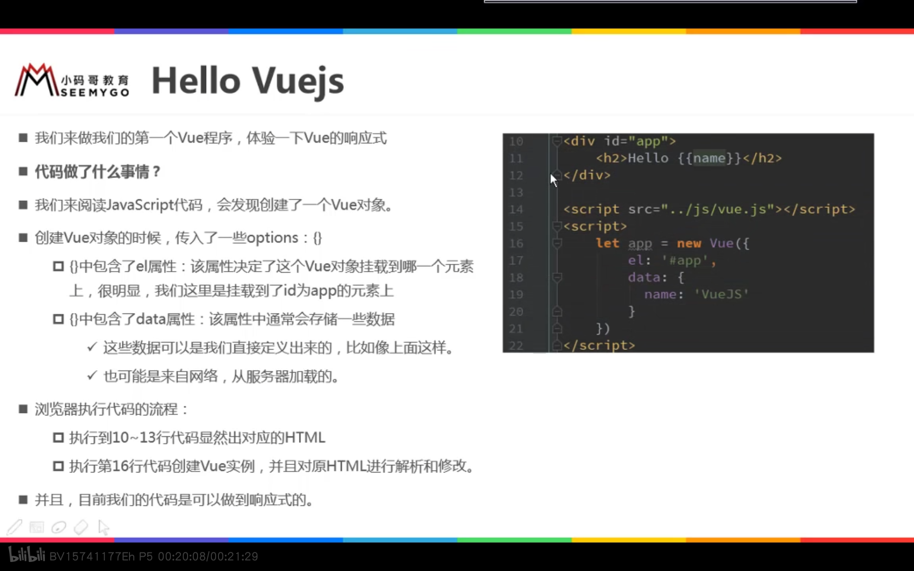
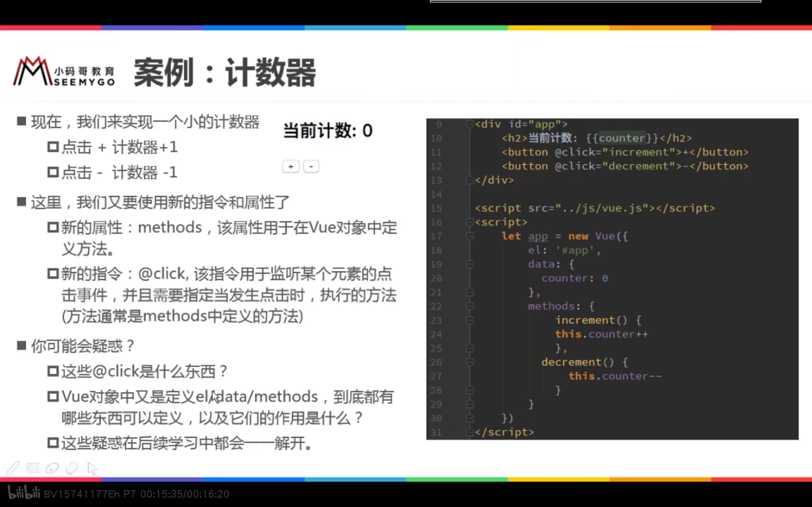
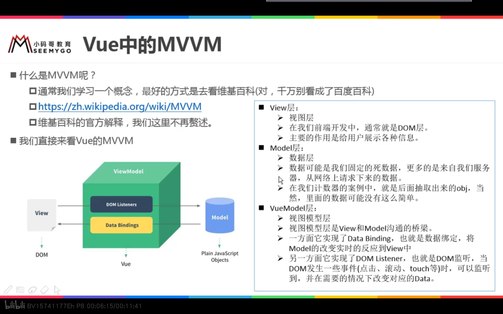

# vue学习文档


### Vue初体验



编程范式:

- 声明式编程

  ```js
  <body>
  <div id="app">
      <h2>{{message}}</h2>
      <h1>{{name}}</h1>
  </div>
  <script src="../js/vue.js"></script>
  <script>
      // let(变量)/const(常量)
      // 编程范式: 声明式编程
      const app = new Vue({
          el: '#app', // 用于挂载要管理的元素
          data: { // 定义数据
              message: '你好啊,李银河!',
              name: 'coderwhy'
          }
      })
  </script>
  </body>
  ```

  

- 命令式编程

  ```js
   元素js的做法(编程范式: 命令式编程)
      1.创建div元素,设置id属性
  
      2.定义一个变量叫message
  
      3.将message变量放在前面的div元素中显示
  
      4.修改message的数据: 今天天气不错!
  
      5.将修改后的数据再次替换到div元素
  ```

### vue案例--计数器



```html
<!DOCTYPE html>
<html lang="en">
<head>
  <meta charset="UTF-8">
  <title>Title</title>
</head>
<body>

<div id="app">
  <h2>当前计数: {{counter}}</h2>
  <!--<button v-on:click="counter++">+</button>-->
  <!--<button v-on:click="counter--;">-</button>-->
  <button v-on:click="add">+</button>
  <button v-on:click="sub">-</button>
  <!--下面是语法糖写法-->
  <!--<button @click="sub">-</button>-->
</div>

<script src="../js/vue.min.js"></script>
<script>
	// 语法糖: 简写
	// proxy
	const obj = {
		counter: 0,
		message: 'abc'
	}

	new Vue()

	const app = new Vue({
		el: '#app',
		data: obj,
		methods: {
			add: function () {
				console.log('add被执行');
				this.counter++
			},
			sub: function () {
				console.log('sub被执行');
				this.counter--
			}
		},
		beforeCreate: function () {
			console.log("beforeCreate函数被执行")
		},
		created: function () {
			console.log('created函数被执行');
		},
		mounted: function () {
			console.log('mounted函数被执行');
		}
	})

	// 1.拿button元素

	// 2.添加监听事件
</script>

</body>
</html>
```


### vue中的MVVM模式



用图说话:


